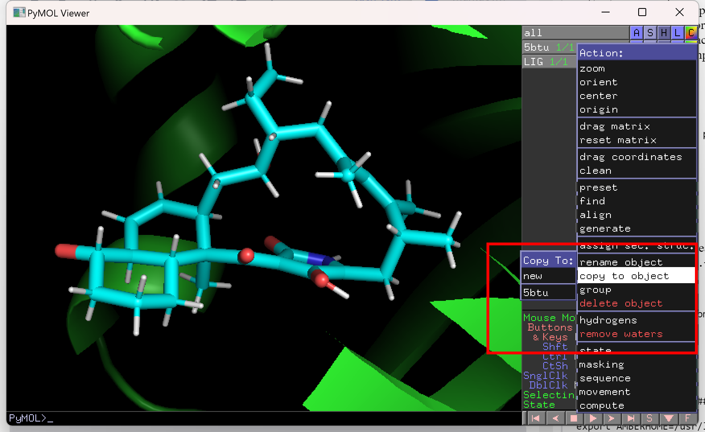

## Ligand parameterization

Ligand parameterization refers to the process of assigning force field parameters to a small molecule (ligand) in order to conduct molecular dynamics simulations or other computational studies. This process involves assigning partial charges, bond lengths, bond angles, dihedral angles, and other parameters to the atoms in the ligand so that they can be properly modeled using a force field. The process typically involves several steps, including converting the ligand structure to a suitable format, assigning atom types and charges, generating the ligand topology file, and validating the accuracy of the parameters through comparison with experimental data or previously reported computational results. 

Gaussian Input File:

```shell
%nproc=12
%mem=16GB
#p hf/6-31g(d) nosymm pop=mk iop(6/50=1,6/33=2,6/41=10,6/42=6) scf=tight

LIG

0 1
<xyz>

LIG.esp
```

After the calculation, create a bash script like what is shown below and excute it. You will get two files, namely `.pdb`, `.frcmod`.

```shell
#$ -cwd
#$ -m bea
#$ -M EMAIL@ADDRESS.com
#$ -o prep.joblog
#$ -e prep.error

LIGAND=LIG
LIGAND_CHARGE=0

\##########################################################################################

export AMBERHOME=/usr/local/amber16/amber16

$AMBERHOME/bin/antechamber -i ${LIGAND}.out -fi gout -o ${LIGAND}.prepin -fo prepi -c resp -at gaff -rn ${LIGAND} -nc ${LIGAND_CHARGE}
$AMBERHOME/bin/antechamber -i ${LIGAND}.out -fi gout -o ${LIGAND}.pdb -fo pdb -at gaff -rn ${LIGAND}
$AMBERHOME/bin/parmchk -i ${LIGAND}.prepin -f prepi -o ${LIGAND}.frcmod

rm ANTECHAMBER* qout QOUT esout punch ATOMTYPE.INF PREP.INF NEWPDB.PDB
```

The `.frcmod` file is a file format used in Amber molecular dynamics simulations to modify or add force field parameters to the standard Amber force field. It stands for "Force Field Modification" and is used to add or modify parameters for specific atoms, bonds, angles, or dihedrals that are not included in the standard Amber force field.

Open the `LIG.pdb` and `protein.pdb` files in pymol and select `Action -> copy to object -> protein`. After that save the protein file as `protein_complex.pdb` by selecting `file -> Export Molecule` in the tool bar.



## Minimization

After preparing the protein complex, we can use the scripts below to prepare the the files we need for simulation, it will add water and cations and will also create a box for the system. 

```shell
#$ -cwd
#$ -m bea
#$ -M EMAIL@ADDRESS.com
#$ -o setup.joblog
#$ -e setup.error


PROTEIN=5btu_complex                                    # Name of the protein. Must match name of PDB file
LIGAND=LIG                                              # Name of ligand. Must match 3 letter code in PDB file


#################################################################################################


export AMBERHOME=/usr/local/amber16/amber16

echo "Generating MD files for the protein: ${PROTEIN}"
echo "Parameters for the following ligands/nonstandard residues will be used:"
#echo "${LIGAND}"
echo "  "

##### TLEAP #####
echo "source leaprc.protein.ff14SB"                                                                >  tleap.in
echo "source leaprc.gaff"                                                                          >> tleap.in
echo "source leaprc.water.tip3p"                                                                   >> tleap.in
echo "loadAmberParams ${LIGAND}.frcmod"                                                         >> tleap.in
echo "loadAmberPrep     ${LIGAND}.prepin"                                                          >> tleap.in
echo "x = loadPDB ${PROTEIN}.pdb"                                                                  >> tleap.in
echo "savepdb x ${PROTEIN}_tleap.pdb"                                                           >> tleap.in
echo "center x"                                                                                    >> tleap.in
echo "alignaxes x"                                                                                 >> tleap.in
echo "addions x Cl- 0"                                                                             >> tleap.in
echo "addions x Na+ 0"                                                                             >> tleap.in
echo "solvateoct x TIP3PBOX 10"                                                                    >> tleap.in
echo "saveamberparm x ${PROTEIN}_wat.prmtop ${PROTEIN}_wat.inpcrd"      >> tleap.in
echo "savepdb x ${PROTEIN}_wat.pdb"                                                                >> tleap.in
echo "quit"                                                                                        >> tleap.in
$AMBERHOME/bin/tleap -f tleap.in -s
rm *nonprot.pdb *renum.txt *water.pdb *sslink* tleap.in leap.log #removes log files

mkdir run/


```


* `source leaprc.protein.ff14SB`: This command loads the force field parameters for the protein from the leaprc.protein.ff14SB file.
* `source leaprc.gaff`: This command loads the force field parameters for the ligand from the leaprc.gaff file.
* `source leaprc.water.tip3p`: This command loads the force field parameters for water molecules from the leaprc.water.tip3p file.
* `loadAmberParams ${LIGAND}.frcmod`: This command loads additional force field parameters for the ligand from the ${LIGAND}.frcmod file.
* `loadAmberPrep ${LIGAND}.prepin`: This command loads the topology file for the ligand from the ${LIGAND}.prepin file.
* `x = loadPDB ${PROTEIN}.pdb`: This command loads the protein structure from the ${PROTEIN}.pdb file into a variable called x.
* `savepdb x ${PROTEIN}_tleap.pdb`: This command saves the protein structure loaded in the previous step to a new PDB file called ${PROTEIN}_tleap.pdb.
* `center x`: This command centers the protein-ligand complex in the simulation box.
* `alignaxes x`: This command aligns the principal axes of the protein-ligand complex with the simulation box axes.
* `addions x Cl- 0`: This command adds chloride ions to the system to neutralize the net charge of the complex.
* `addions x Na+ 0`: This command adds sodium ions to the system to achieve the desired salt concentration.
* `solvateoct x TIP3PBOX 10`: This command solvates the protein-ligand complex in a cubic water box of size 10 Angstroms.
* `saveamberparm x ${PROTEIN}_wat.prmtop ${PROTEIN}_wat.inpcrd`: This command saves the topology and coordinate files for the solvated protein-ligand complex in Amber format.
* `savepdb x ${PROTEIN}_wat.pdb`: This command saves the solvated protein-ligand complex in PDB format.
* `quit`: This command exits the tleap program.